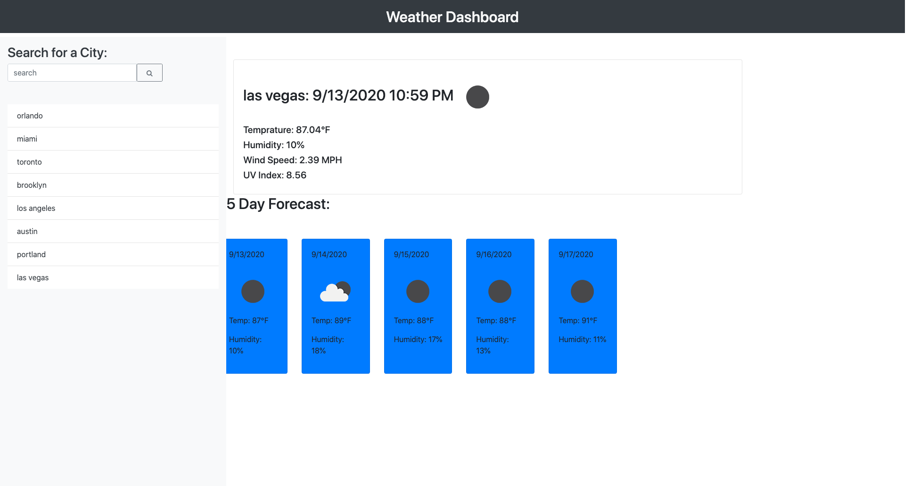

# Challenge-6-Weather-Dashboard

#### Sources Links:
* [GitHub Repository](https://github.com/jcgom3/Challenge-6-Weather-Dashboard)
* [Deployed GitHub IO](https://jcgom3.github.io/Challenge-6-Weather-Dashboard)

#### Project Screenshot

### Summary

In this application we apply third party APIs to obtain the current weather and a 5-day forecast. Javascript is used along with Bootstrap in an Html format to make the application interactive for the user. A list of cities are stored in a card-like format where they are saved in the local storage. User can click the previous searched cities to obtain their corresponding forecasts.

### This project uses the following languages and frameworks: 

* HTML
* Bootstrap
* JavaScript
* jQuery
* moment.js
* Open Weather Map
* CSS

### Has a responsive layout for: 
* Small devices
* Medium devices
* Large devices
* Extra large devices

## Authors

* **Juan Carlos Gomez**